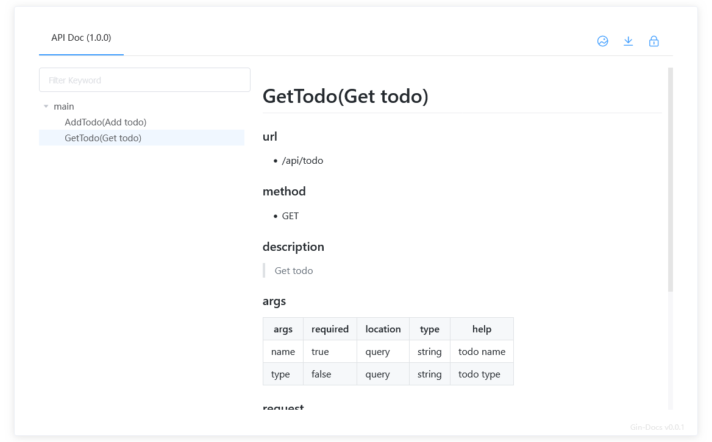
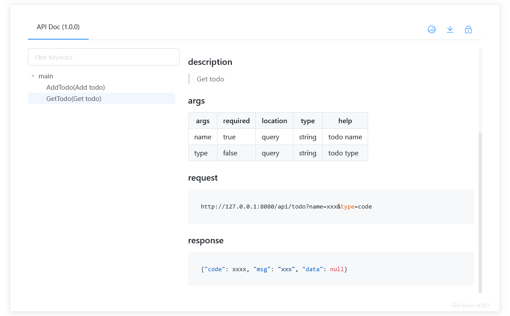
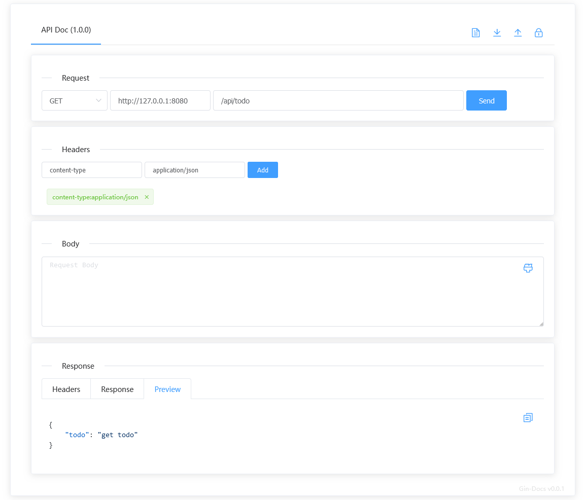
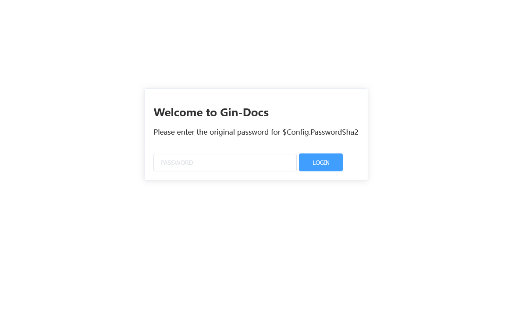

# Gin-Docs

[](https://github.com/kwkwc/gin-docs/actions/workflows/test.yml)
[](https://codecov.io/gh/kwkwc/gin-docs)
[](https://goreportcard.com/report/github.com/kwkwc/gin-docs)
[](https://pkg.go.dev/github.com/kwkwc/gin-docs)


[](https://github.com/kwkwc/gin-docs/blob/main/LICENSE)

> Adds Docs support to Gin.

English | [简体中文](README.zh-CN.md)

## Features

- Automatic generation of markdown documentation
- Support offline markdown document download
- Support online debugging
- Support Generate offline document
  - [x] HTML
  - [x] Markdown

## Installation

```bash
go get -u github.com/kwkwc/gin-docs
```

## Usage

```go
import (
    "github.com/gin-gonic/gin"
    gd "github.com/kwkwc/gin-docs"
)

r := gin.Default()
r.POST("/api/todo", AddTodo)
r.GET("/api/todo", GetTodo)

c := &gd.Config{}
apiDoc := gd.ApiDoc{Ge: r, Conf: c.Default()}
apiDoc.OnlineHtml()

r.Run()
```

## View the documentation page

```shell
http://127.0.0.1/docs/api/
```

## Page demo

[Online Demo][online_demo]

## Configuration

```go
type Config struct {
	// Title, default `API Doc`
	Title string
	// Version, default `1.0.0`
	Version string
	// Description
	Description string

	// Custom CDN CSS Template
	CdnCssTemplate string
	// Custom CDN JS Template
	CdnJsTemplate string

	// Custom url prefix, default `/docs/api`
	UrlPrefix string
	// No document text, default `No documentation found for this API`
	NoDocText string
	// Enable document pages, default `true`
	Enable bool
	// Using CDN, default `false`
	Cdn bool
	// API package name to exclude
	Exclude []string
	// Methods allowed to be displayed, default `[]string{"GET", "POST", "PUT", "DELETE", "PATCH"}`
	MethodsList []string
	// SHA256 encrypted authorization password, e.g. here is admin
	// echo -n admin | shasum -a 256
	// `8c6976e5b5410415bde908bd4dee15dfb167a9c873fc4bb8a81f6f2ab448a918`
	PasswordSha2 string
	// Enable markdown processing for all documents, default `true`
	AllMd bool
}
```

## Tag @@@

```shell
# Process all documents in markdown by default
# 1. use the `@@@` wrapper if you want to specify processing
# 2. Turn off `Config.AllMd` and remove the `@@@` tag if you want to display the original document

@@@
# Write your markdown document here
@@@
```

## API

````go
/*
Add todo

### args
|  args | required | location | type   |  help    |
|-------|----------|----------|--------|----------|
| name  |  true    |  json    | string | todo name |
| type  |  true    |  json    | string | todo type |

### request
```json
{"name": "xx", "type": "code"}
```

### response
```json
{"code": xxxx, "msg": "xxx", "data": null}
```
*/
func AddTodo(c *gin.Context) {
	c.JSON(http.StatusOK, gin.H{
		"todo": "post todo",
	})
}
````


````go
/*
Get todo

### description
> Get todo

### args
|  args | required | location |  type  |  help    |
|-------|----------|----------|--------|----------|
|  name |  true    |  query   | string | todo name |
|  type |  false   |  query   | string | todo type |

### request
```
http://127.0.0.1:8080/api/todo?name=xxx&type=code
```

### response
```json
{"code": xxxx, "msg": "xxx", "data": null}
```
*/
func GetTodo(c *gin.Context) {
	c.JSON(http.StatusOK, gin.H{
		"todo": "get todo",
	})
}
````




## Debugger



## Authentication



## Generate offline document

```go
r := gin.Default()

c := &gd.Config{}
apiDoc := gd.ApiDoc{Ge: r, Conf: c.Default()}

// HTML: Generate offline html document at `htmldoc/`
out := "htmldoc"
apiDoc.OfflineHtml(out, true)

r.StaticFile(c.UrlPrefix+"/", filepath.Join(out, "index.html"))
r.StaticFile(c.UrlPrefix+"/data", filepath.Join(out, "data"))
r.Static(c.UrlPrefix+"/static", filepath.Join(out, "static"))

// Markdown: Generate the `doc.md` offline markdown document
apiDoc.OfflineMarkdown("doc.md", true)
```

## Examples

[Complete example][examples]

## Development

```bash
# Clone code
git clone git@github.com:kwkwc/gin-docs.git

# Working directory
cd gin-docs

# Install dependencies
make install

# Run check
make check-all
```

## Transplantation project

[Flask-Docs](https://github.com/kwkwc/flask-docs/)

[examples]: https://github.com/kwkwc/gin-docs/tree/main/examples

[online_demo]: https://kwkwc.github.io/gin-docs-demo/
