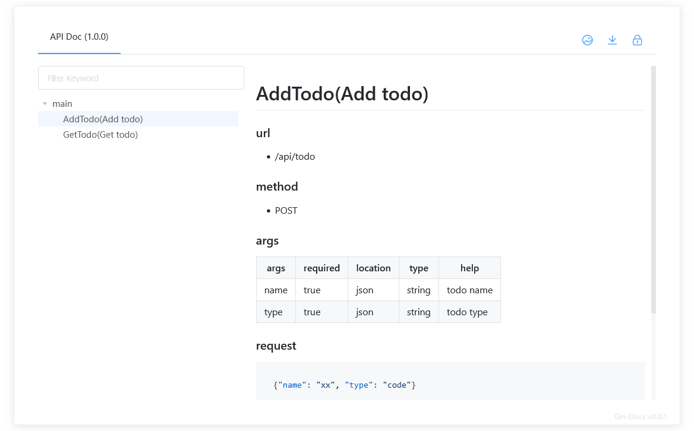
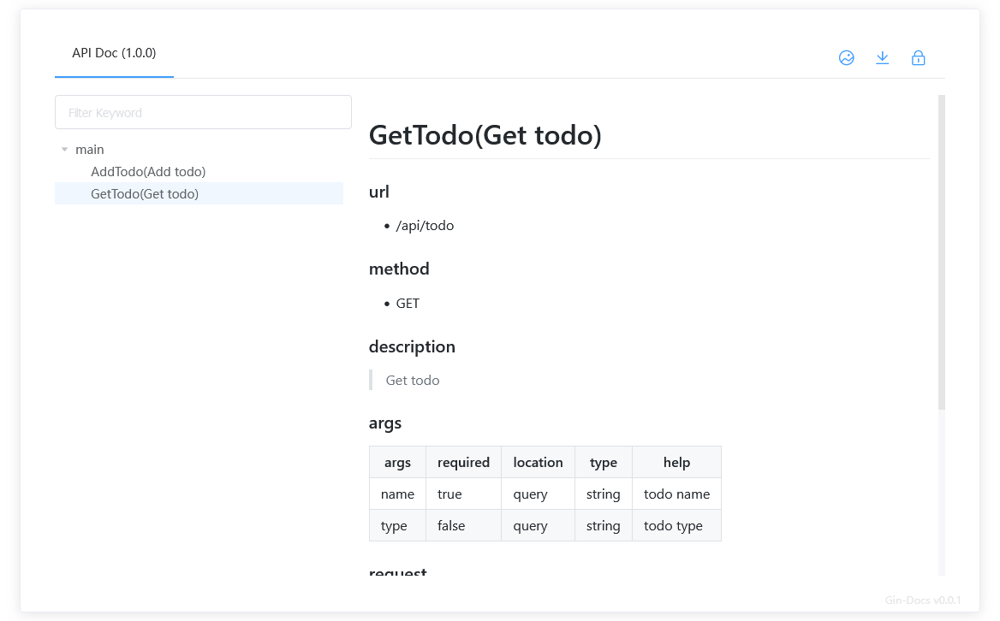
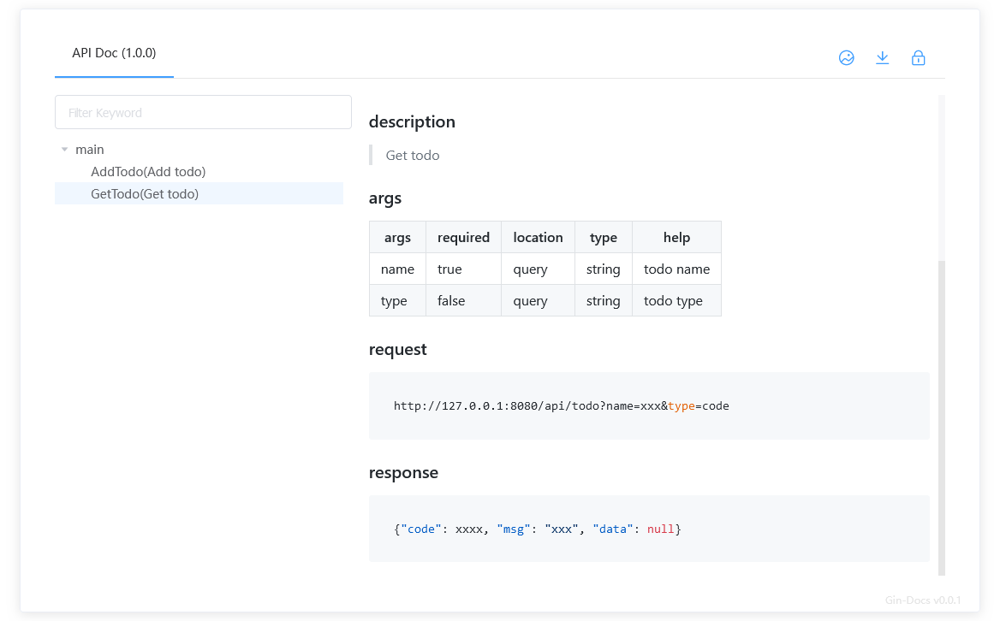
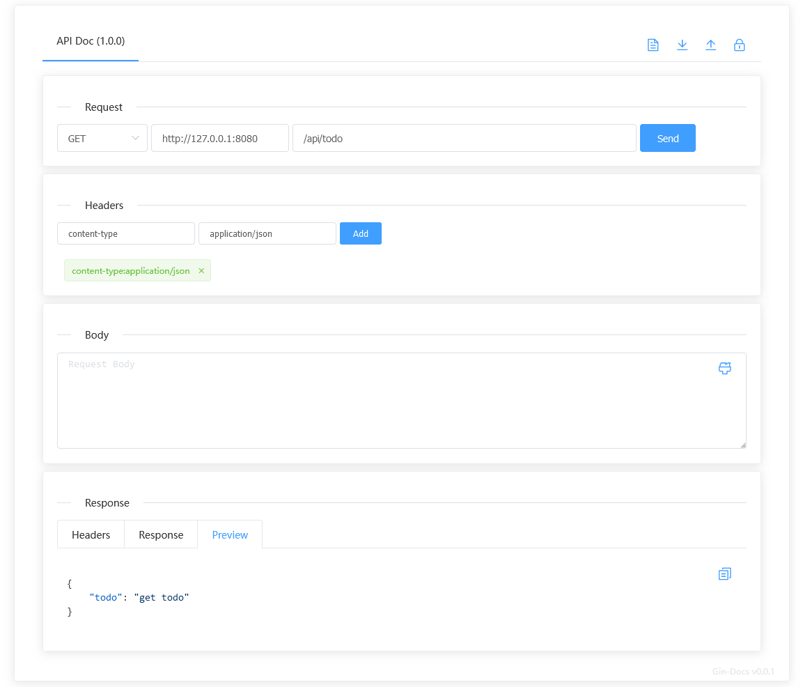
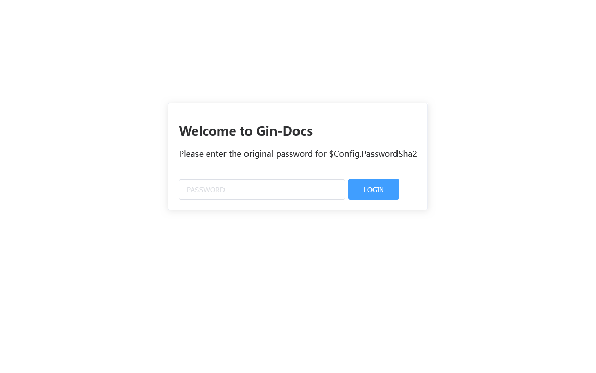

# Gin-Docs

[](https://github.com/kwkwc/gin-docs/actions/workflows/test.yml)
[](https://codecov.io/gh/kwkwc/gin-docs)
[](https://goreportcard.com/report/github.com/kwkwc/gin-docs)
[](https://pkg.go.dev/github.com/kwkwc/gin-docs)


[](https://github.com/kwkwc/gin-docs/blob/main/LICENSE)

> Gin API 文档自动生成插件

[English](README.md) | 简体中文

## 特性

- 根据代码注释自动生成 Markdown 文档
- 支持离线 Markdown 文档下载
- 支持在线调试
- 支持生成离线文档
  - [x] HTML
  - [x] Markdown

## 安装

```bash
go get -u github.com/kwkwc/gin-docs
```

## 使用

```go
import (
    "github.com/gin-gonic/gin"
    gd "github.com/kwkwc/gin-docs"
)

r := gin.Default()
r.POST("/api/todo", AddTodo)
r.GET("/api/todo", GetTodo)

c := &gd.Config{}
apiDoc := gd.ApiDoc{Ge: r, Conf: c.Default()}
apiDoc.OnlineHtml()

r.Run()
```

## 查看文档页面

```shell
http://127.0.0.1/docs/api/
```

## 演示

[在线演示][online_demo]

## 配置

```go
type Config struct {
	// 标题, default `API Doc`
	Title string
	// 版本, default `1.0.0`
	Version string
	// 描述
	Description string

	// 自定义 CDN CSS 模板
	CdnCssTemplate string
	// 自定义 CDN JS 模板
	CdnJsTemplate string

	// 自定义 url prefix, default `/docs/api`
	UrlPrefix string
	// 文档不存在时的描述, default `No documentation found for this API`
	NoDocText string
	// 启用文档页面, default `true`
	Enable bool
	// 使用 CDN, default `false`
	Cdn bool
	// 需要排除的 API 包名
	Exclude []string
	// 允许显示的方法, default `[]string{"GET", "POST", "PUT", "DELETE", "PATCH"}`
	MethodsList []string
	// SHA256 加密的授权密码，例如这里是 admin
	// echo -n admin | shasum -a 256
	// `8c6976e5b5410415bde908bd4dee15dfb167a9c873fc4bb8a81f6f2ab448a918`
	PasswordSha2 string
	// 启用 markdown 处理所有文档, default `true`
	AllMd bool
}
```

## 标记 @@@

```shell
# 默认以 markdown 处理所有文档
# 1. 如果希望指定处理，请使用 `@@@` 包裹
# 2. 如果希望展示原始文档，请关闭 `Config.AllMd`，并去除 `@@@` 标记

@@@
# 在这里写下你的 markdown 文档
@@@
```

## API

````go
/*
Add todo

### args
|  args | required | location | type   |  help    |
|-------|----------|----------|--------|----------|
| name  |  true    |  json    | string | todo name |
| type  |  true    |  json    | string | todo type |

### request
```json
{"name": "xx", "type": "code"}
```

### response
```json
{"code": xxxx, "msg": "xxx", "data": null}
```
*/
func AddTodo(c *gin.Context) {
	c.JSON(http.StatusOK, gin.H{
		"todo": "post todo",
	})
}
````



````go
/*
Get todo

### description
> Get todo

### args
|  args | required | location |  type  |  help    |
|-------|----------|----------|--------|----------|
|  name |  true    |  query   | string | todo name |
|  type |  false   |  query   | string | todo type |

### request
```
http://127.0.0.1:8080/api/todo?name=xxx&type=code
```

### response
```json
{"code": xxxx, "msg": "xxx", "data": null}
```
*/
func GetTodo(c *gin.Context) {
	c.JSON(http.StatusOK, gin.H{
		"todo": "get todo",
	})
}
````




## 调试器



## 认证



## 生成离线文档

```go
r := gin.Default()

c := &gd.Config{}
apiDoc := gd.ApiDoc{Ge: r, Conf: c.Default()}

// HTML: 在 `htmldoc/` 生成离线 HTML 文档
out := "htmldoc"
apiDoc.OfflineHtml(out, true)

r.StaticFile(c.UrlPrefix+"/", filepath.Join(out, "index.html"))
r.StaticFile(c.UrlPrefix+"/data", filepath.Join(out, "data"))
r.Static(c.UrlPrefix+"/static", filepath.Join(out, "static"))

// Markdown: 生成 `doc.md` 离线 Markdown 文档
apiDoc.OfflineMarkdown("doc.md", true)
```

## 示例

[完整示例][examples]

## 开发

```bash
# 克隆代码
git clone git@github.com:kwkwc/gin-docs.git

# 工作目录
cd gin-docs

# 安装依赖
make install

# 运行检查
make check-all
```

## 移植项目

[Flask-Docs](https://github.com/kwkwc/flask-docs/)

[examples]: https://github.com/kwkwc/gin-docs/tree/main/examples

[online_demo]: https://kwkwc.github.io/gin-docs-demo/
